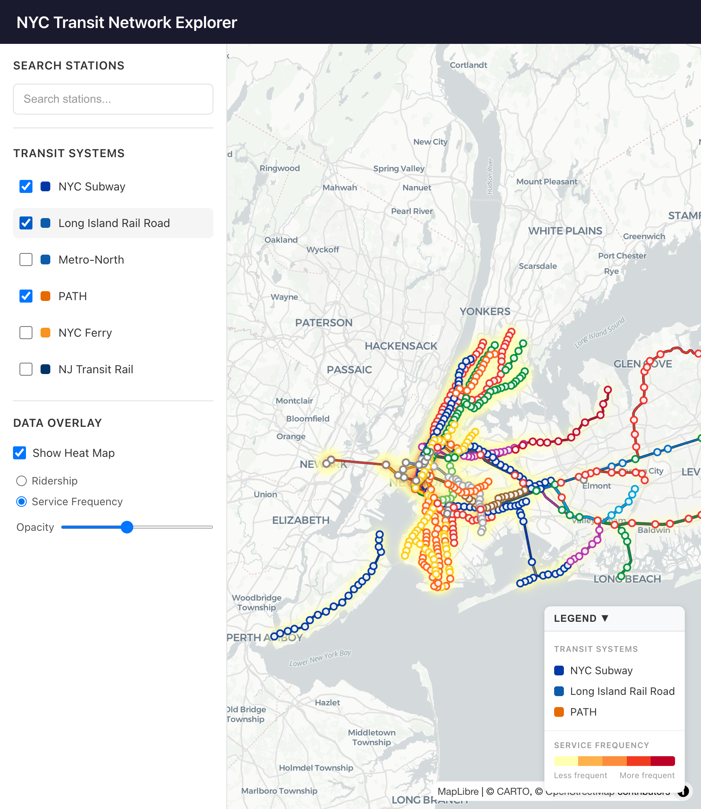
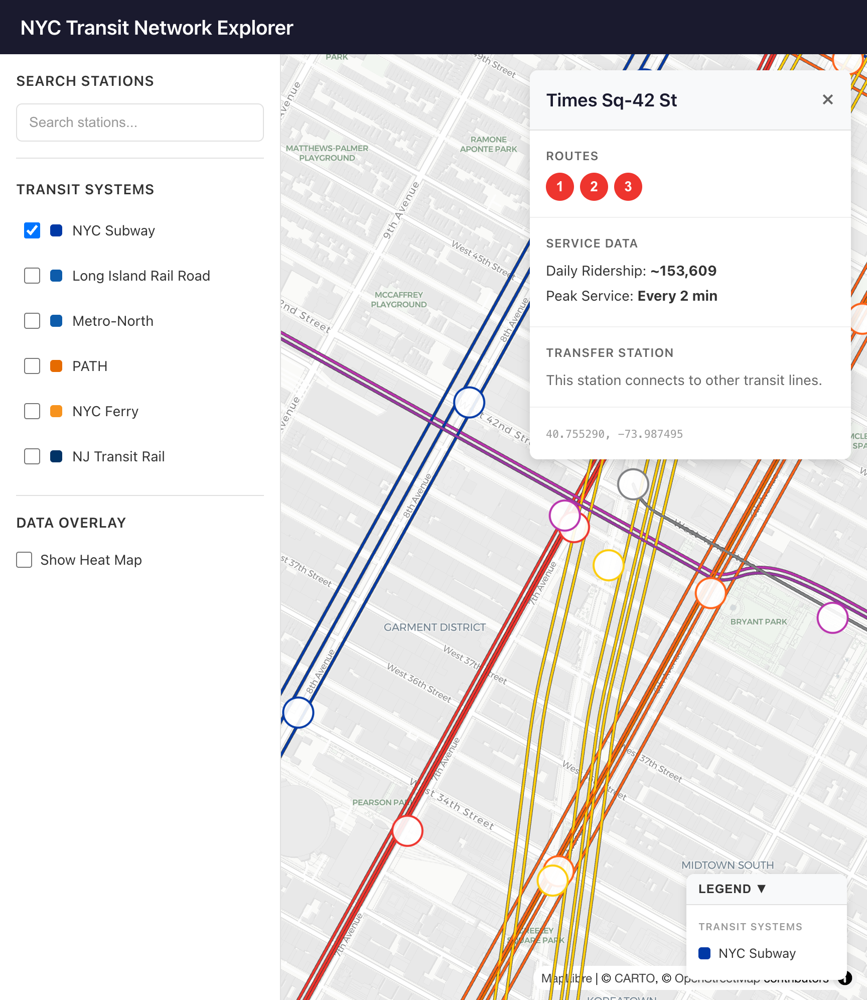
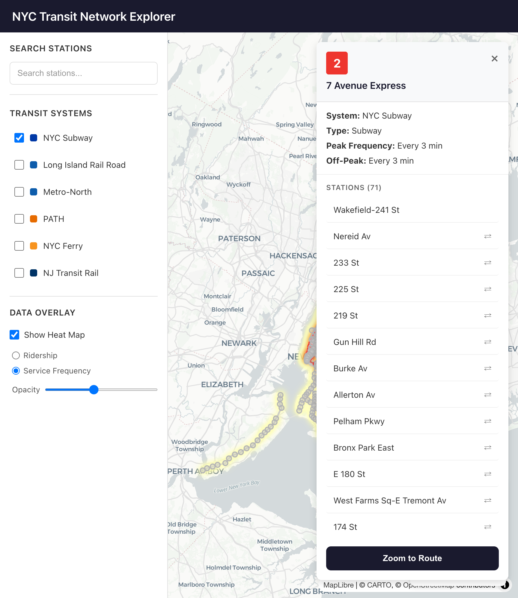
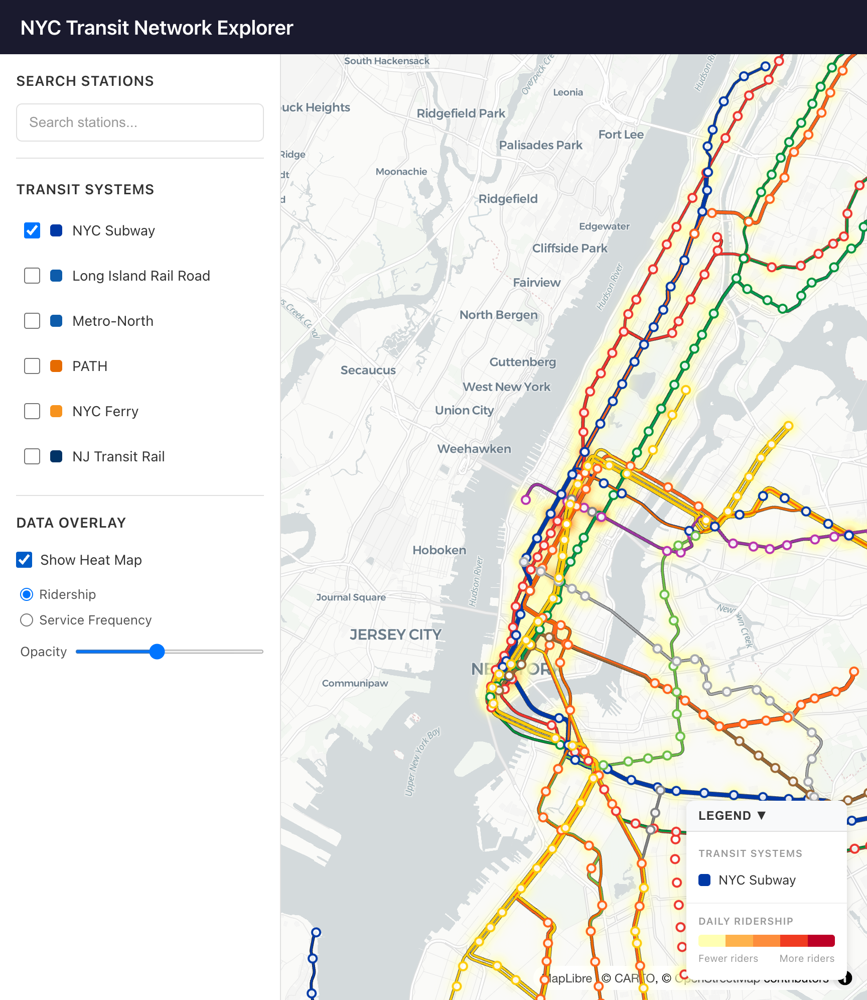

# NYC Transit Network Explorer

An interactive web application for exploring the New York City metropolitan transit network. Visualize subway lines, commuter rail, ferries, and regional transit systems on a single interactive map with ridership data and service frequency overlays.



## Features

- **Interactive map** with pan, zoom, and rotate controls (deck.gl + MapLibre)
- **6 transit systems**: Subway, LIRR, Metro-North, PATH, NJ Transit Rail, NYC Ferry
- **Station details**: click any station to see routes served, daily ridership, peak service frequency, and transfer connections
- **Route details**: view stations in travel order, peak/off-peak frequency, and zoom-to-route
- **Ridership heatmap**: visualize daily ridership or service frequency as a heat overlay
- **Fuzzy search**: find stations by name with autocomplete and keyboard navigation
- **Legend**: floating card showing active systems and heatmap gradient scale
- Official transit agency color schemes with parallel line offsets for overlapping routes

### Station Detail Panel

Click any station to see routes, ridership data, and service frequency.



### Route Detail Panel

Click a route badge or line on the map to see all stations in travel order with frequency info.



### Ridership Heatmap

Toggle the heatmap overlay to visualize daily ridership or service frequency across the network.



**Documentation:**
- [spec.md](./spec.md) - Detailed functionality specification
- [plan.md](./plan.md) - Implementation plans and roadmap
- [todo.md](./todo.md) - Project task list with completion status

## Quick Start

```bash
# Install dependencies
npm install

# Build transit data (downloads and processes GTFS feeds)
npm run data:build

# Start development server
npm run dev
```

Open http://localhost:5173 to view the application.

## Project Structure

```
nyc-transport-network/
├── src/                      # Frontend React application
│   ├── components/           # React components
│   │   ├── Map/              # Map visualization
│   │   ├── Panels/           # UI panels (station detail, system selector)
│   │   └── UI/               # Layout components (sidebar)
│   ├── constants/            # Configuration (transit systems, colors)
│   ├── hooks/                # React hooks (data loading)
│   ├── services/             # Data fetching utilities
│   ├── stores/               # Zustand state management
│   ├── types/                # TypeScript type definitions
│   ├── App.tsx               # Main application component
│   └── main.tsx              # Application entry point
├── scripts/                  # Data processing pipeline
│   ├── download/             # GTFS feed downloaders
│   ├── parse/                # GTFS parsing and transformation
│   └── build-data.ts         # Main build orchestrator
├── public/data/systems/      # Generated JSON data files
├── data/raw/gtfs/            # Downloaded GTFS zip files (cached)
├── spec.md                   # Detailed functionality specification
└── package.json
```

### Key Directories

| Directory | Purpose |
|-----------|---------|
| `src/components/Map/` | Deck.gl + MapLibre map rendering, route/station/heatmap layers |
| `src/components/Panels/` | Station detail, route detail, search, and system selector panels |
| `src/constants/systems.ts` | Transit system definitions and line colors |
| `src/stores/mapStore.ts` | Zustand store for map state, selections, enabled systems |
| `src/hooks/useTransitData.ts` | Hook for loading and caching transit data |
| `scripts/parse/gtfs-parser.ts` | GTFS parsing, transforms feeds to application JSON format |
| `scripts/build-data.ts` | Orchestrates download and parsing for all systems |
| `public/data/systems/` | Output JSON files consumed by the frontend |

## Technology Stack

- **Frontend**: React 18, TypeScript, Vite
- **Mapping**: MapLibre GL JS, deck.gl (PathLayer, ScatterplotLayer, HeatmapLayer)
- **State Management**: Zustand
- **Search**: Fuse.js (fuzzy matching)
- **Data Sources**: GTFS feeds, MTA Socrata API (ridership)
- **Styling**: CSS

## Available Scripts

| Command | Description |
|---------|-------------|
| `npm run dev` | Start development server |
| `npm run build` | Build for production |
| `npm run preview` | Preview production build |
| `npm run data:build` | Build all transit system data |
| `npm run data:build <system>` | Build specific system (e.g., `npm run data:build subway`) |

## Adding a New Transit System

To add a new transit agency to the project:

### 1. Define the System

Add an entry to the `TRANSIT_SYSTEMS` array in `src/constants/systems.ts`:

```typescript
{
  id: 'new-system',           // Unique ID (kebab-case)
  name: 'New Transit System', // Display name
  agency: 'Transit Agency',   // Operating agency
  type: 'rail',               // 'subway' | 'rail' | 'bus' | 'ferry'
  color: '#003366',           // Brand color (hex)
  enabled: false,             // Default toggle state
}
```

### 2. Add Line Colors (Optional)

Add line-specific colors to `SYSTEM_CONFIGS` in `scripts/parse/gtfs-parser.ts`:

```typescript
'new-system': {
  id: 'new-system',
  name: 'New Transit System',
  agency: 'Transit Agency',
  type: 'rail',
  color: '#003366',
  lineColors: {
    'Line A': { color: '#FF0000', textColor: '#FFFFFF' },
    'Line B': { color: '#00FF00', textColor: '#000000' },
  },
}
```

### 3. Add to Build Pipeline

Add the system to the `SYSTEMS` array in `scripts/build-data.ts`:

```typescript
{
  id: 'new-system',
  downloadFn: async () => {
    ensureDir(DATA_DIR);
    const destPath = path.join(DATA_DIR, 'new-system.zip');
    await downloadFile('https://example.com/gtfs.zip', destPath);
    return destPath;
  },
  optional: false,  // Set true if feed may be unavailable
}
```

### 4. Build and Test

```bash
# Build just the new system
npm run data:build new-system

# Verify output
ls -la public/data/systems/new-system.json

# Test in browser
npm run dev
```

The new system will automatically appear in the System Selector sidebar.

## Data Pipeline

The data pipeline transforms GTFS feeds into optimized JSON for the frontend:

```
GTFS Zip (routes.txt, stops.txt, shapes.txt, stop_times.txt, ...)
    ↓
Download (scripts/download/*.ts or inline in build-data.ts)
    ↓
Parse (scripts/parse/gtfs-parser.ts)
    ├── Extract routes with colors
    ├── Extract stations (parent stations for rail)
    ├── Build route geometries from shapes
    ├── Map routes to stations with travel order
    ├── Calculate peak/off-peak service frequency
    └── Compute parallel line offsets
    ↓
Enrich (subway only)
    └── Match MTA ridership data from Socrata API (data.ny.gov)
    ↓
Output JSON (public/data/systems/{system-id}.json)
```

### Output Format

Each system JSON file contains:

```typescript
{
  system: {
    id: string,
    name: string,
    agency: string,
    type: 'subway' | 'rail' | 'bus' | 'ferry',
    color: string,
    enabled: boolean
  },
  routes: Array<{
    id: string,           // "{systemId}:{routeId}"
    shortName: string,    // "A", "NEC", etc.
    longName: string,     // Full route name
    color: string,        // Hex color
    textColor: string,    // Text color for badges
    stationOrder?: string[],        // Station IDs in travel order
    peakHeadwayMinutes?: number,    // Peak service frequency
    offPeakHeadwayMinutes?: number  // Off-peak service frequency
  }>,
  stations: Array<{
    id: string,           // "{systemId}:{stopId}"
    name: string,
    latitude: number,
    longitude: number,
    routeIds: string[],   // Routes serving this station
    isTransferPoint: boolean,
    accessibility?: { ada: boolean, elevator: boolean },
    annualRidership?: number,  // From MTA Socrata API (subway only)
    dailyRidership?: number    // Derived from annual
  }>,
  routeGeometries: Array<{
    routeId: string,
    coordinates: [number, number][]  // [lon, lat] pairs
  }>
}
```

## Current Transit Systems

| System | Routes | Stations | Data Source |
|--------|--------|----------|-------------|
| NYC Subway | 29 | 496 | MTA GTFS + Socrata ridership |
| Long Island Rail Road | 13 | 127 | MTA GTFS |
| Metro-North | 6 | 114 | MTA GTFS |
| PATH | 6 | 43 | Port Authority GTFS |
| NYC Ferry | 8 | 50 | NYC Ferry GTFS |
| NJ Transit Rail | 16 | 227 | NJ Transit GTFS |

## License

MIT
